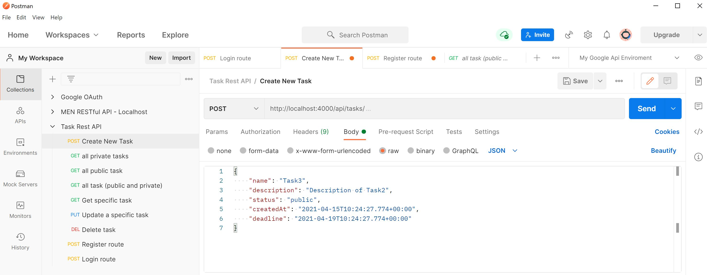
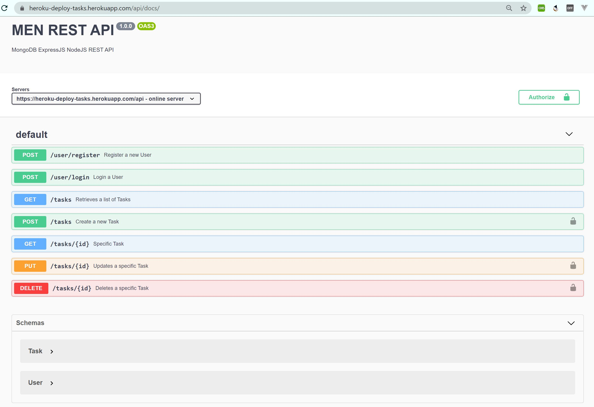
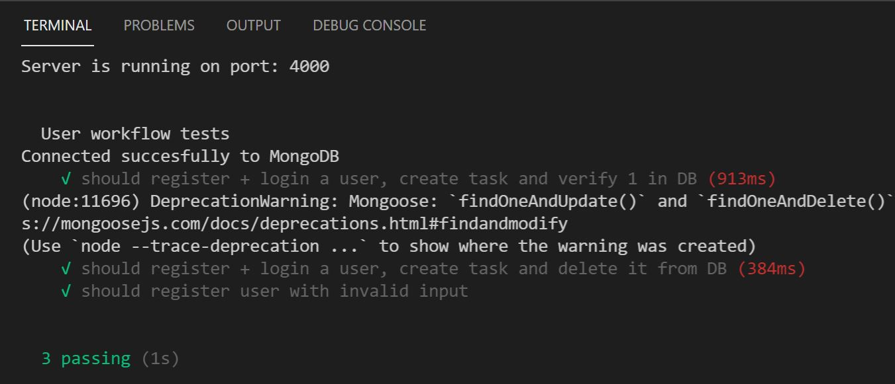

# Building a REST API with MEN
> CRUD API that also has authentication bilt in (without frontend).

## Database - NoSQL
* MongoDB Atlas
* CRUD routes
* Auth - User model
* Nodemon

## Test with
* Postman
> Test with Postman


* Swagger
> Implementation and test


* Mocha & Chai 
> Test with Mocha & Chai 

## Usage
```
# Install Node.js and npm 
(Node package manager)
npm install -g npm

# Run in development
npm run dev

# Run in production
npm start
```
